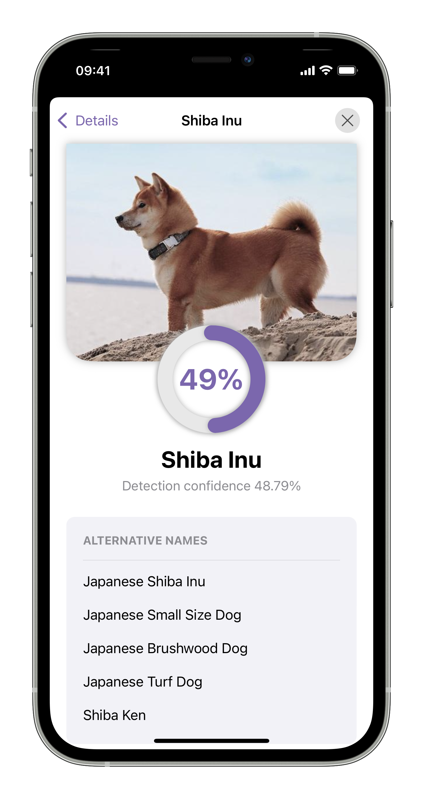

# Dogtector
<p align="center">

<br>
<a href="https://apps.apple.com/us/app/dogtector/id1597156924"></a>
</p>

## Project description
Dogtector is dog breed detection app for iOS using [YOLOv5](https://github.com/ultralytics/yolov5) model combined with Metal based object decoder optimized for ultra fast live detection on iOS devices.

<center>



</center>

## Technical Overview
### Requirements
Project was developed in Swift 5.5 using XCode 13.1 and was designed for devices running iOS 14 and newer.
- XCode 13.1+
- Swift 5.5+
- iOS 14.0+

### Technologies
Vast majority of the project was created in SwiftUI and Combine (UIKit was used only when there was no SwiftUI alternative for desired components or functionality) and all the porting part of YOLOv5 model was handled with CoreML and Metal.
- SwiftUI
- UIKit (when necessary)
- Combine
- CoreML
- Metal 

### Object decoder
The most important part of the project was porting trained YOLOv5 model to iOS which turned out to be challenging for massive model trained with 417 class objects. The most basic CPU approach for object decoding was not enough as it resutled in 1.7 fps of live detection on devices equipped with latest A15 chips. Finally, the approach that worked sufficiently well for the desired use case was implementing the object decoder in Metal to process the output using GPU.

The created Metal based object decoder has been optimized for all iPhones with iOS 14 and newer taking advantage of the latest GPU enhancements on the newer models keeping support for devices as old as iPhone 6S at the same time. As a result there emerged two strategies for object decoding:
1. Fastest full metal based decoder - available only for devices with GPU Family 4 (A11 and newer) taking the full adventages of fast GPU processing
2. Slightly slower hybrid based decoder (mostly Metal, partly CPU based) - available for all older devices, as older GPU families seemed to have issues with atomic operations in loops in Metal kernels and do not support non-uniform thread grids

### Performance

Finally, the Metal implementations appeared to be fast enough to be used for live detection for the computationally expensive model I intended to use. With comparision to CPU implementation, live detection on iPhone 13 Pro turned out to be approximaly 25x faster with the Metal decoder acheiving ~43 fps of live detection from initial ~1.7 fps on CPU.

Speed of the live detection depends largely on model parameters such as amount of classess and model input size. However, devices with Apple Neural Engine and faster GPUs perform better when compared using the same model.

The table below shows acheived results on various devices for YOLOv5m model trained with 417 object classes and with 288x288 input size: 


<center>

| Device | iPhone 13 Pro  | iPhone 12 Pro | iPhone 11 Pro  | iPhone X | iPhone 6s |
|---|---|---|---|---|---|
| Chip | A15 | A14 | A13 | A11 | A9 |
| [ANE](https://github.com/hollance/neural-engine/blob/master/docs/supported-devices.md)  |  ✅<br>(5th gen) |  ✅ <br>(4th gen)| ✅ <br>(3rd gen) |  ❌</br>(private) |  ❌ |
| [Apple GPU family](https://developer.apple.com/metal/Metal-Feature-Set-Tables.pdf)  | 8 |  7 |  6 | 4 | 3 |
| Live detection performance | 30+ fps</br>(throttled*) | 30+ fps</br>(throttled*) | ~15 fps | ~5 fps | ~2.7 fps |

</center>

*Camera output has been limited to 30 fps for stability and battery reasons but in raw conditions A15 and A14 acheived ~43 fps and ~35 fps of live detection, respectively.

## Build and run
Dotgtector has been build with pure iOS SDK without any external libraries / frameworks so building and running is as simple as opening `Dogtector.xcodeproj` file with XCode and running `Dogtector` target. 

Important note: this repository does not contain the trained model used in the production version of Dogtector so if you would like to build the application with trained model you need to follow the instructions from [bringing own model](#Bringing-own-model) section. However, if you want to just preview how the appliaction works without getting your own model [you can download the production version of the application from the App Store](https://apps.apple.com/us/app/dogtector/id1597156924). 

## Bringing own model
### Model setup
You can configure the project to work with your model very easily as it was designed to be as flexible as possible for all the models from YOLOv5 family and should work fine regardless of different model parameters like amount of classes or input size.

First, you need trained YOLOv5 model. If you don't have any [you can follow this tutorial to train your own](https://github.com/ultralytics/yolov5/wiki/Train-Custom-Data). Keep in mind that weights in Pytorch `.pt` format won't work with CoreML so you need to convert your model to the compatible `.mlmodel` format using `coremltools`. If you don't know how, please follow [these instructions](https://github.com/ultralytics/yolov5/issues/251).

When you have your trained model in CoreML format you just have to drag and drop it to your workspace in XCode. By default the application will seek for `Detector.mlmodel` file but if you want to use different name you have to change `assetName` value in  [`Dogtector/ObjectDetector/ModelInfo.swift`](./Dogtector/ObjectDetector/ModelInfo.swift).

### Class information
The last step is updating information about classes in order to display detection annoations properly. This data is stored in [`Dogtector/ObjectDetector/en.lproj/ObjectInfo.plist`](Dogtector/ObjectDetector/en.lproj/ObjectInfo.plist). Object class information can be localized and by default there is also Polish version of the file in `Dogtector/ObjectDetector/pl.lproj` directory. 

Most important requirements for `ObjectInfo.plist` file:
- The data should be reflection of the classes used to train your model
- Order of the items in array and should be exactly the same as in your trained model
- Identifier should be unique

Object format description:
- `identifier` - [required] - should be unique string, is used to find object image to display on the screen. App will seek for images named `{identifier}` for larger resolution preivew and for `{identifier}_miniature` thumbnail images for faster rendereing of annoatations. Although it is not colpulsory to add images of each of the classes info the project, this field is also used for internal class object identification purposes so it is required to add it even if you don't plan to add any images.
- `name` - [required] - string with name of class object displayed to the user.
- `alternativeNames` - [optional] - array of strings with alternative class names displayed to the user. These will be displayed in `Alternative names` section on detection information sheet - was designed to display alternative dog breed names.
- `origin` - [optional] - array of strings with origin of class item - was designed to display countries of origin of dog breeds.
- `url` - [optional] - string with URL to more information about class object - was designed to display `More info` button on information sheet if present.
- `licence` - [optional] - string with information about licence of displayed image.

Whole object format looks like this:
```
<dict>
        <key>identifier</key>
        <string>UNIQUE_NAME_IDENTIFIER</string>
        <key>name</key>
        <string>OBJECT_DISPLAYED_NAME</string>
        <key>alternativeNames</key>
        <array>
            <string>ALTERNATIVE_NAME_1</string>
        </array>
        <key>origin</key>
        <array>
            <string>ORIGIN_INFO_1</string>
        </array>
        <key>url</key>
        <string>URL_TO_MORE_INFO</string>
        <key>licence</key>
        <string>INFO_ABOUT_IMAGE_LICENCE</string>
    </dict>
```
The only required fields are `identifier` and `name` so the simplest working example for the whole `plist` file would be:
```
<?xml version="1.0" encoding="UTF-8"?>
<!DOCTYPE plist PUBLIC "-//Apple//DTD PLIST 1.0//EN" "http://www.apple.com/DTDs/PropertyList-1.0.dtd">
<plist version="1.0">
<dict>
        <key>identifier</key>
        <string>dog</string>
        <key>name</key>
        <string>Dog</string>
</dict>
</array>
</plist>
```